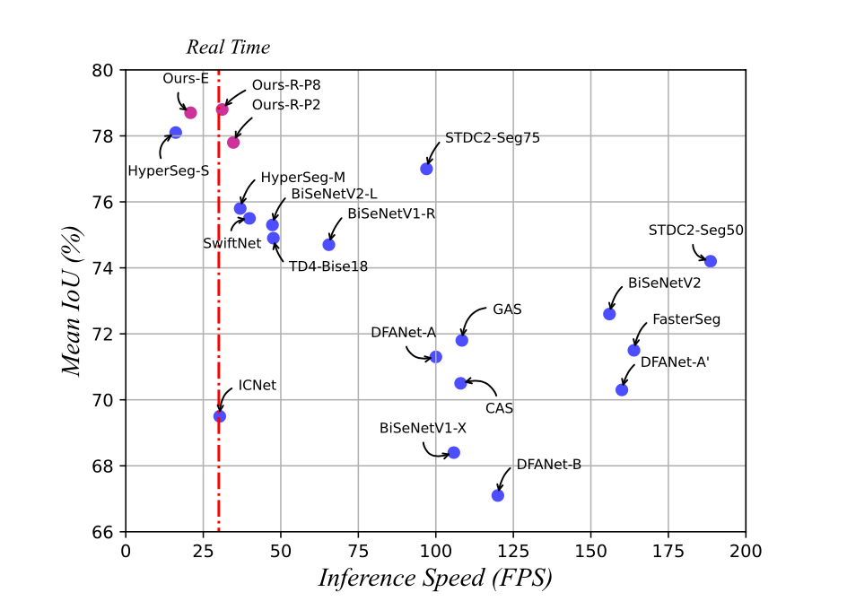
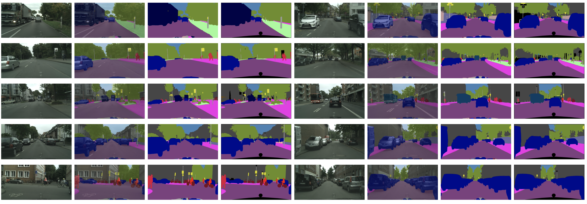

# Real-time Semantic Segmentation via Densely Aggregated Bilateral Network (DABNet) 


<div  align="center"> 

</div>



## Installation

Our project is developed based on [MMsegmentation](https://github.com/open-mmlab/mmsegmentation). MMSegmentation is an open source semantic segmentation toolbox based on PyTorch. Please refer to [get_started.md](docs/get_started.md#installation) for installation and [dataset_prepare.md](docs/dataset_prepare.md#prepare-datasets) for dataset preparation.

> Documentation: https://mmsegmentation.readthedocs.io/
>
> English | [简体中文](README_zh-CN.md)

```text
Due to my unfamiliarity with github, I may make mistakes (so you can use MMsegmentation and just copy my code). 
At the same time, I usually use "BiseNetV1_res" as my network name during the experiment (because DABNet is indeed improved based on BiseNetV1).
Although I made changes before uploading, there may still be some naming conflicts (eg BiseNetV1_Res vs DABNet, HFA vs PCE). 
I used the naming scheme "BiseNetV1_Res" in my public logs, hope it doesn't confuse you.
```

### Enviroment

- **Benchmark**

```shell
conda create -n open-mmlab python=3.7 -y
conda activate open-mmlab

conda install pytorch=1.6.0 torchvision cudatoolkit=10.1 -c pytorch -y
pip install mmcv-full -f https://download.openmmlab.com/mmcv/dist/cu101/torch1.6.0/index.html
git clone https://github.com/isyangshu/DABNet.git
cd DABNet
pip install -e .  # or "python setup.py develop"
pip install -e .[all]

mkdir data
```

- **Additional Dependencies**


```shell
pip install einops  # used for transpose
pip install timm==0.4.12 # used for Efficientnet_B1
```

In order to change the BatchNorm in the Efficientnet to SydncBatchNorm, we need to modify the relevant code in `timm/models/efficientnet.py`:

`norm_layer=kwargs.pop('norm_layer', None) or partial(nn.BatchNorm2d, **resolve_bn_args(kwargs)),`
 
For more details, please refer to [EfficientNet](https://github.com/rwightman/pytorch-image-models/blob/master/timm/models/efficientnet.py).

- **TensorRT**

  TensorRT needs a version that strictly matches Cuda and Cudnn.
  Refer to [TensorRT](https://docs.nvidia.com/deeplearning/tensorrt/archives/index.html) to deploy the appropriate Cuda, Cudnn, TensorRT versions, and make sure their versions match MMCV, MMsegmentation.
  For the specific installation method and version selection, please refer to [MMSegmentation](https://mmcv.readthedocs.io/en/latest/deployment/tensorrt_plugin.html).
  
  We simulate inference and measure inference speed (FPS) on NVIDIA GTX 1080Ti GPU with CUDA 10.2, CUDNN 8.0.4, and TensorRT 7.2.1.6. （Just need to configure according to the above method on the machine with GTX1080ti, pay attention to modify the pytorch and mmcv corresponding to the cuda version.）
### Datasets
#### Cityscapes

> The data could be found [hear](https://www.cityscapes-dataset.com/downloads/) after registration.
> 
> You can also test Cityscapes results in the same website.

By convention, `**labelTrainIds.png` are used for cityscapes training. We provided a scripts based on cityscapesscripts to generate `**labelTrainIds.png`.

```shell
# --nproc means 8 process for conversion, which could be omitted as well.
python tools/convert_datasets/cityscapes.py data/cityscapes --nproc 8

```
#### COCO-10k

```shell
# download
mkdir coco_stuff10k && cd coco_stuff10k
wget http://calvin.inf.ed.ac.uk/wp-content/uploads/data/cocostuffdataset/cocostuff-10k-v1.1.zip

# unzip
unzip cocostuff-10k-v1.1.zip

# --nproc means 8 process for conversion, which could be omitted as well.
python tools/convert_datasets/coco_stuff10k.py /path/to/coco_stuff10k --nproc 8
```

#### COCO-164k

```shell
# download
mkdir coco_stuff164k && cd coco_stuff164k
wget http://images.cocodataset.org/zips/train2017.zip
wget http://images.cocodataset.org/zips/val2017.zip
wget http://calvin.inf.ed.ac.uk/wp-content/uploads/data/cocostuffdataset/stuffthingmaps_trainval2017.zip

# unzip
unzip train2017.zip -d images/
unzip val2017.zip -d images/
unzip stuffthingmaps_trainval2017.zip -d annotations/

# --nproc means 8 process for conversion, which could be omitted as well.
python tools/convert_datasets/coco_stuff164k.py /path/to/coco_stuff164k --nproc 8
```

#### CamVid

The images have a resolution of 960 × 720 and 32 semantic categories, in which the subset of 11 classes are used for segmentation experiments. The original data could be found [hear](http://mi.eng.cam.ac.uk/research/projects/VideoRec/CamVid/). 

> The annotations should be label index for mmsegmentation. If each mask is a specific class label for camvid, you should fuse all the masks of an image to generate the label index annotations. Use label index to represent the categories in the annotations.

I provide a script `/tools/convert_datasets/camvid.py` to convert the Camvid dataset, note that you need to change the path (`train/val/test`).

> This code runs a little slow, you can get the data directly from [CamVid-baidu (j9qu)](https://pan.baidu.com/s/1hExlf0uZ0kuar99xzpL0Sw). `TrainID` indicates available annotations.

## Training and Testing
 Please see [train.md](docs/train.md) and [inference.md](docs/inference.md) for the basic usage of MMSegmentation.
There are also tutorials for [customizing dataset](docs/tutorials/customize_datasets.md), [designing data pipeline](docs/tutorials/data_pipeline.md), [customizing modules](docs/tutorials/customize_models.md), and [customizing runtime](docs/tutorials/customize_runtime.md).
MMSegmentation also provides many [training tricks](docs/tutorials/training_tricks.md) for better training and [useful tools](docs/useful_tools.md) for deployment.

### Train
```shell
./tools/dist_train.sh ${configs} ${GPU Nums}
nohup ./tools/dist_train.sh ${configs} ${GPU Nums} 2>&1 &
# For example, train a DABNet-Resnet18 on Cityscapes dataset with 4 GPUs
nohup ./tools/dist_train.sh configs/dabnet/dabnet_r18-d32_in1k-pre_4x8_1024x1024_80k_cityscapes.py 4 2>&1 &
```

> More detail, please refer to [Train Doc](https://mmsegmentation.readthedocs.io/en/latest/train.html).

### Test

```shell
# Test mIoU for Cityscapes
python tools/test.py ${configs} ${checkpoints} --eval mIoU
```

Test DABNet on cityscapes test split with 4 GPUs, and generate the png files to be submit to the official evaluation server.

First, add following to config file ${configs},

>data = dict(
    test=dict(
        img_dir='leftImg8bit/test',
        ann_dir='gtFine/test'))
        
Then run test.
```shell
./tools/dist_test.sh ${configs} ${checkpoints} 4 --format-only --eval-options "imgfile_prefix=./test_results"
```
> zip and submit `test_results`

> More detail, please refer to [Test Doc](https://mmsegmentation.readthedocs.io/en/latest/inference.html).

### Latency
Different from the code of MMsegmentation, we refer to FasterSeg and STDC to implement tools for testing speed.

## Results

> I need more time to train and test.
> Please wait.
### Cityscapes

| Method          | Crop Size | Inference Size | Batch size | iteration | set  | val mIoU  | test mIoU  | FPS | model                                                        | config                                                       |
| --------------- | --------- | ---------------- | ---------- | --------- | ---- | ----- | ----- |----- |------------------------------------------------------------ | ------------------------------------------------------------ |
| DABNet_R_P1      | 1024x1024   | 2048x1024  | 8 * 4     | 80k     | val       | 77.4 |   -  | 33.5 | - | [config](logs/dabnet-P1.log) |
| DABNet_R_P2      | 1024x1024   | 2048x1024  | 8 * 4     | 80k     | val       | 77.8 | 76.1 | 34.9 | - | [config](logs/dabnet-cityscapes.log) |
| DABNet_R_P4      | 1024x1024   | 2048x1024  | 8 * 4     | 80k     | val       | 78.1 |   -  | 34.7 | - | [config](logs/dabnet-P4.log) |
| DABNet_R_P8      | 1024x1024   | 2048x1024  | 8 * 4     | 80k     | val       | 78.8 | 77.3 | 31.1 | - | [config](logs/DABNet-P8.log) |
| DABNet_R_P16     | 1024x1024   | 2048x1024  | 8 * 4     | 80k     | val       | 78.4 |   -  | 21.0 | - | [config](logs/dabnet-P16.log) |
| DABNet_E         | 1024x1024   | 2048x1024  | 4 * 4     | 80k     | val       | 78.7 | 77.5 | 20.3 | - | [config](logs/dabnet-E-cityscapes.log) |
| DABNet_R_P1      | 1024x1024   | 2048x1024  | 8 * 4     | 80k     | train+val |   -  |   -  |   -  | - | - |
| DABNet_R_P2      | 1024x1024   | 2048x1024  | 8 * 4     | 80k     | train+val |   -  |   -  |   -  | - | - |
| DABNet_R_P4      | 1024x1024   | 2048x1024  | 8 * 4     | 80k     | train+val |   -  |   -  |   -  | - | - |
| DABNet_R_P8      | 1024x1024   | 2048x1024  | 8 * 4     | 80k     | trian+val |   -  |   -  |   -  | - | - |
| DABNet_R_P16     | 1024x1024   | 2048x1024  | 8 * 4     | 80k     | train+val |   -  |   -  |   -  | - | - |
| DABNet_E         | 1024x1024   | 2048x1024  | 4 * 4     | 80k     | trian+val |   -  |   -  |   -  | - | - |

### COCO-10k

| Method          | Crop Size | Inference Size | Batch size | iteration | mIoU  | pixACC | FPS  | model                                                        | config                                                       |
| --------------- | --------- | ---------------- | ---------- | --------- | ---- | ----- | ----- |------------------------------------------------------------ | ------------------------------------------------------------ |
| DABNet_R_P2     | 512x512  | 640x640  | 8 * 4   | 80k | 29.5 | 63.1 | 104.6 | - | [config](logs/dabnet-coco10k.log) |
| DABNet_E        | 512x512  | 640x640  | 8 * 4   | 80k | 32.4 | 65.5 | 70.8  | - | [config](logs/dabnet-e-coco10k.log) |

### CamVid

| Method          | Crop Size | Inference Size | Batch size | iteration | set  | mIoU | FPS                                                    | config                                                       |
| --------------- | --------- | ---------------- | ---------- | --------- | ---- | ----- |------------------------------------------------------------ | ------------------------------------------------------------ |
| DABNet_R_P2     | 960x768  | 960x768  | 2 * 4   | 10k       | train+val  | 74.3 | 92.2 | [config](logs/README.md) |
| DABNet_E        | 960x768  | 960x768  | 2 * 4   | 10k       | train+val  | 76.5 | 56.5 | [config](logs/README.md) |

## Results & PretrainedParams

### Test results

### PretrainedParams
